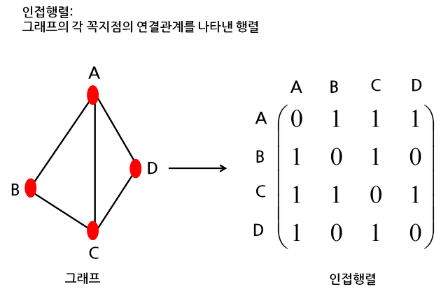

## 1. 피보나치 수열 1
- 피보나치 수를 구하는 함수를 만들어 보세요.
    - **input**: n
    - **output**: n 번째 피보나치 수
- **재귀 함수**로 만들어 보세요.
- 뼈대 코드
    ```python
    def fib_naive(n):
        ???
    ```

## 2. 피보나치 수열 2
- 피보나치 수를 구하는 함수를 만들어 보세요.
    - **input**: 
        - n: 몇 번째 피보나치 수를 구할지에 대한 정수
        - solutions: 현재까지 구한 피보나치 해답들을 갖고있는 저장소
    - **output**: 
        - n 번째 피보나치 수
        - solutions: n 번째 피보나치 수를 추가하여 업데이트한 해답 저장소
- **Dynamic programming**을 사용하는 **재귀 함수**로 만들어 보세요.
- solutions 는 딕셔너리로 구현합니다.
    - key: i (어떤 정수)
    - val: i 번째 피보나치 수
    - 예) solutions[0] = 1 : 0번째 피보나치 수는 1이라는 뜻.
- 뼈대 코드
    ```python
    def fib_dynamic(n, solutions):
        ???
    ```
- 여러 버전으로 구현해도 좋지만, 다음과 같은 흐름으로 구현해도 됩니다.
    ```python
    def fib_dynamic(n, solutions):
        # 초기조건
        만약 n이 0이거나 1이면
            n번째 피보나치 수는 1로 정한다.

            solutions에 n번째 피보나치 수가 1이라는 사실을 저장한다.

        # 재귀 식
        그렇지 않으면
            n-1 번째 피보나치 수를 구한다.

            n-2 번째 피보나치 수를 구한다.

            n 번째 피보나치 수를 구한다.
            이 때 위에서 구한 n-1 번째와 n-2 번째 피보나치 수를 이용한다.

            solutions에 n번째 피보나치수를 저장한다.

        return n번째 피보나치 수, solutions
    ```

## 3. 피보나치 수열 3
- 피보나치 수를 구하는 함수를 만들어 보세요.
    - **input**: n
    - **output**: n 번째 피보나치 수
- 재귀 함수가 **아닌** 버전으로 만들어 보세요. 
- loop문을 사용해 보세요. loop문을 사용하는 함수는 iterative 하다고 말합니다.
- 뼈대 코드
    ```python
    def fib_iterative(n):
        ???
    ```

## 4. 인접 행렬 만들기
- 다음 주어진 그래프의 인접행렬을 numpy array로 만들어 보세요.
    - 
- 인접 행렬이란 그래프(graph)에서 어느 꼭짓점(node)들이 변(edge)으로 연결되었는지 나타내는 정사각행렬이다.
    - graph란 쉽게 말하면 network이다.
    - node는 graph 내의 꼭짓점이다.
    - edge는 node를 연결하는 선이다.
    - ex) social network
        - graph: social network
        - node: user
        - edge: 친구 관계
- 인접행렬은 주로 A라고 부른다. 영어로 인접행렬이 Adjacency matrix라서 A라고 부르는듯.
- 인접행렬 A 는 다음과 같이 구성한다.
    - 행렬 크기
        - 총 row 수: node 개수
        - 총 column 수: node 개수
    - 행렬 값
        - node1과 node2가 edge로 연결되어있을 때: 
            - A[node1 의 번째 수][node2의 번째 수] = 1
        - node1과 node2가 edge로 연결되어있을 때: A
            - [node1 의 번째 수][node2의 번째 수] = 0
    - 예를 들면 다음 그림과 같다.
        - 


